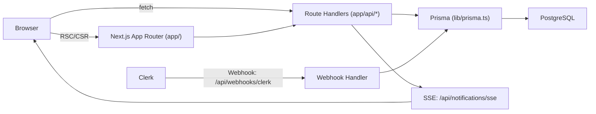

# X-clone

一个使用 Next.js 构建的 Twitter/X 简化版克隆项目，包含发帖、关注、点赞、通知与图片上传。

## 功能概览

- 登录/注册（Clerk）
- 发帖（最多 280 字，可选配图）
- 首页信息流：显示「自己 + 已关注用户」的帖子
- 个人主页：用户信息 + 用户帖子列表
- 点赞/取消点赞（对他人帖子点赞会触发通知）
- 关注/取消关注（关注会触发通知）
- 通知列表 + 未读数角标 + SSE 实时推送

## 技术栈

- Web 框架：Next.js 15（App Router）+ React 19 + TypeScript
- 认证：Clerk（`@clerk/nextjs`），通过 Webhook 同步用户到本地数据库
- 数据库与 ORM：PostgreSQL + Prisma
- 文件上传：UploadThing（上传后使用返回的 `ufsUrl` 作为图片地址）
- 样式：Tailwind CSS
- UI：lucide-react 图标、react-hot-toast 提示、date-fns（中文时间格式）

## 项目架构（高层）



说明：

- 页面层（`app/(main)/*`）混合了 Server Components（直连 Prisma 查询）与 Client Components（通过 `fetch` 调用 API）。
- 鉴权由 `middleware.ts` 的 Clerk Middleware 统一处理，除了登录/注册与 Webhook 入口外均需登录。
- 通知推送使用 SSE，连接存放在 Node 进程内存（开发环境最合适；生产多实例需要额外改造，见下方说明）。

## 目录结构

- `app/`
  - `app/layout.tsx`：全局布局（ClerkProvider、Toaster、全局样式）
  - `app/(auth)/...`：登录/注册页面（Clerk 组件）
  - `app/(main)/...`：主站页面（首页/通知/个人主页/帖子详情）
  - `app/api/*`：后端 API（帖子/点赞/关注/通知/用户/上传/Webhook）
- `components/`：UI 组件（侧边栏、右侧推荐、发帖、帖子卡片、用户组件、通知项）
- `hooks/`：前端 hooks（SSE 连接）
- `lib/`
  - `lib/prisma.ts`：PrismaClient 单例封装
  - `lib/notifications.ts`：SSE 连接注册与推送（内存 Map）
  - `lib/uploadthing.ts`：UploadThing React 组件封装
  - `lib/utils.ts`：样式合并工具 `cn()`
- `prisma/schema.prisma`：数据库模型定义（User/Post/Like/Follow/Notification）
- `middleware.ts`：路由保护（Clerk）

## 快速开始（本地开发）

### 1) 前置依赖

- Node.js：建议 20.x（18.18+ 理论上也可）
- PostgreSQL：本地安装或使用云数据库均可

### 2) 安装依赖

本项目仓库里有 `package-lock.json`，默认使用 npm：

```bash
npm install
```

### 3) 配置环境变量

复制 `.env.example` 并补全：

```bash
cp .env.example .env.local
```

需要的环境变量（与 `.env.example` 一致）：

- `DATABASE_URL`：PostgreSQL 连接串（Prisma 使用）
- `NEXT_PUBLIC_CLERK_PUBLISHABLE_KEY`：Clerk 前端 Key
- `CLERK_SECRET_KEY`：Clerk 后端 Key
- `CLERK_WEBHOOK_SECRET`：Clerk Webhook Secret（用于校验 `svix-*` 签名）
- `NEXT_PUBLIC_CLERK_SIGN_IN_URL`：默认 `/sign-in`
- `NEXT_PUBLIC_CLERK_SIGN_UP_URL`：默认 `/sign-up`
- `NEXT_PUBLIC_CLERK_AFTER_SIGN_IN_URL`：默认 `/`
- `NEXT_PUBLIC_CLERK_AFTER_SIGN_UP_URL`：默认 `/`
- `UPLOADTHING_TOKEN`：UploadThing Token

提示：

- `NEXT_PUBLIC_*` 会被打包到前端，请勿把任何私密信息放进 `NEXT_PUBLIC_*`。
- 项目会把 Clerk 的 `user.id` 当作本地 `User.id`，并通过 Webhook 把用户资料写入数据库；因此 Webhook 配置是必需的（否则页面/推荐关注可能拿不到用户信息）。

### 4) 初始化数据库

本仓库未包含 `prisma/migrations/`，本地开发推荐直接 `db push`：

```bash
npm run db:generate
npm run db:push
```

如果你更希望使用迁移文件（会创建 `prisma/migrations/`）：

```bash
npm run db:migrate
```

### 5) 启动开发服务器

```bash
npm run dev
```

默认访问 `http://localhost:3000`。

## Clerk 配置要点

### 1) 应用 Keys

在 Clerk Dashboard 获取：

- Publishable key -> `NEXT_PUBLIC_CLERK_PUBLISHABLE_KEY`
- Secret key -> `CLERK_SECRET_KEY`

### 2) Webhook（同步用户到本地数据库）

本项目监听的 Webhook 路径：

- `POST /api/webhooks/clerk`

需要在 Clerk Dashboard 创建 Webhook，并订阅至少以下事件：

- `user.created`
- `user.updated`
- `user.deleted`

把 Webhook Secret 配到：

- `CLERK_WEBHOOK_SECRET`

### 3) Username 建议

本项目大量使用 `username` 做 profile 路由（`/:username`）。建议在 Clerk 中启用/要求 username（或确保用户能生成 username），否则当前登录用户在侧边栏可能不显示“个人主页”入口。

## UploadThing 配置要点

- 上传入口：`app/api/uploadthing/*`
- 前端使用 `UploadButton`（见 `components/post/PostComposer.tsx`）
- 需要配置 `UPLOADTHING_TOKEN`

## 通知 SSE 的实现与限制

- SSE 入口：`GET /api/notifications/sse`
- 服务端连接存储：`lib/notifications.ts` 使用内存 `Map`

限制（重要）：

- 这是「单进程/单实例」方案，适合本地开发。
- 若部署到多实例或无状态/函数式环境，内存 Map 无法跨实例共享，通知实时推送可能不稳定。
  - 生产建议：用 Redis Pub/Sub、消息队列或专用推送服务替换 `lib/notifications.ts` 的内存连接管理。

## 常见问题（Troubleshooting）

- Prisma 连接失败：检查 `DATABASE_URL` 是否可连通，且数据库已创建。
- 页面没数据/推荐关注为空：确认 Clerk Webhook 已配置并成功触发，把用户写入 `User` 表。
- 通知不实时：确认浏览器能建立 `EventSource(/api/notifications/sse)`；开发环境下刷新页面可重连。
- `next build` 提示 workspace root/lockfile 警告：通常是上级目录存在额外 lockfile 导致，移除多余 lockfile 或在 `next.config.ts` 设置 `outputFileTracingRoot`。

## 常用命令

```bash
npm run dev
npm run build
npm run start

npm run db:generate
npm run db:push
npm run db:migrate
```
